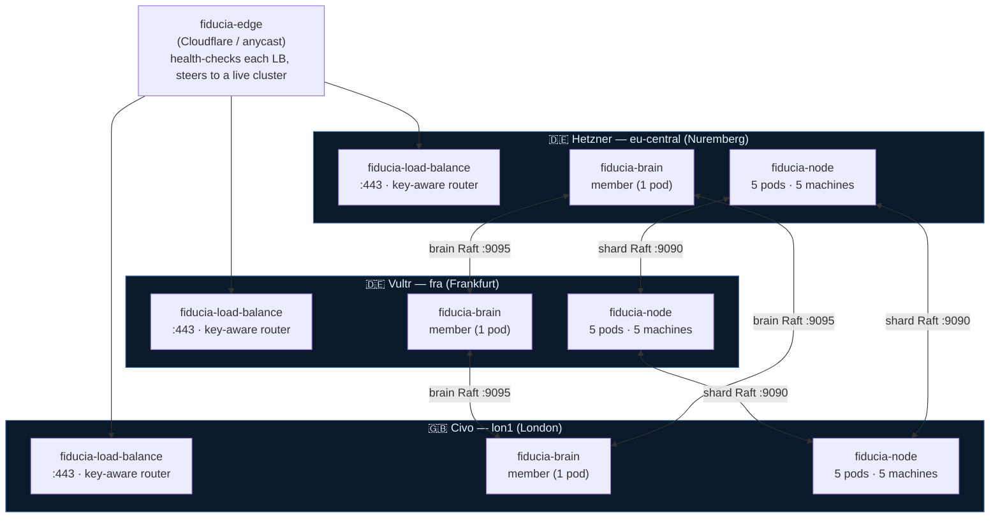
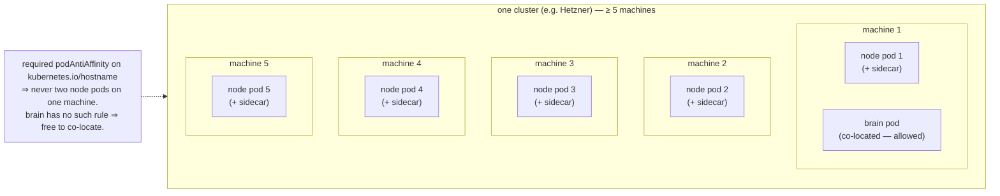
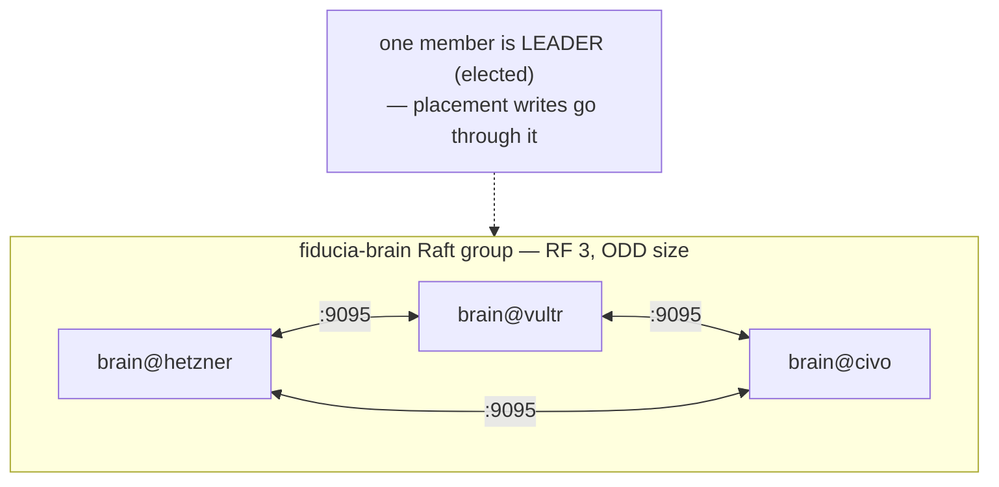
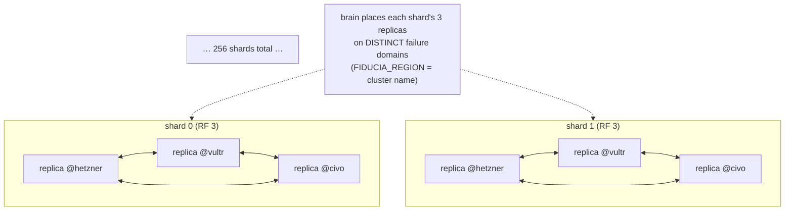
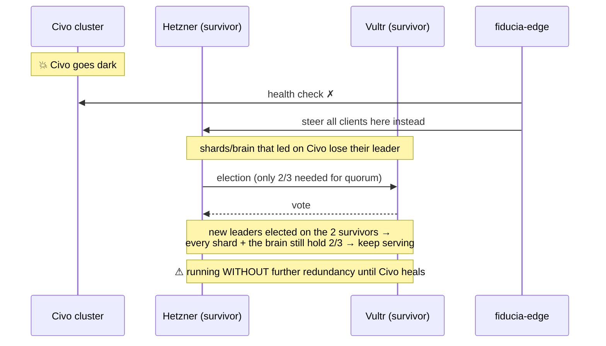
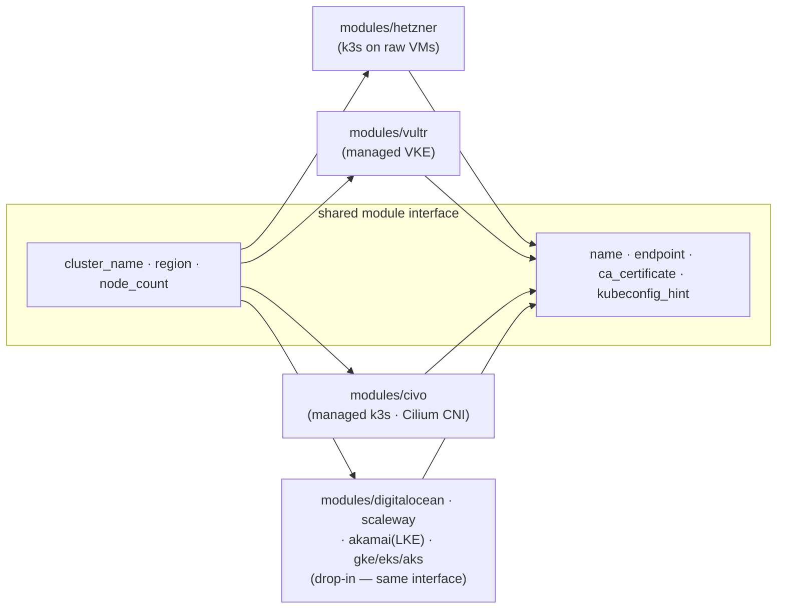
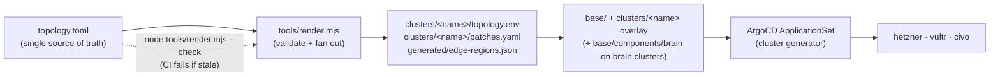

# Multi-cluster architecture

How fiducia runs as **one logical system across three Kubernetes clusters on
three different clouds** — Hetzner, Vultr, and Civo — so that losing any one
cloud does not take the service down.

This document is the architecture reference. The *values* it describes
(clusters, endpoints, shard/replication factors, Raft timing) all come from one
file, [`topology.toml`](../topology.toml); see
[README.md](../README.md) for the operational how-to and
[docs/ROLLOUT.md](ROLLOUT.md) for the runbook. The same architecture is drawn as
UML in [architecture.puml](architecture.puml).

---

## 1. Goal in one sentence

> **As long as 2 of the 3 clusters are alive, fiducia keeps serving reads and
> writes** — because every unit of state is a 3-member Raft group with exactly
> **one member per cluster**, so a cluster is a *failure domain*, not a single
> point of failure.

Two independent Raft layers give that guarantee:

| Layer | What it decides | Membership | Group size |
|-------|-----------------|------------|------------|
| **Data plane** — `fiducia-node` | the customer coordination state (locks, leases, fencing tokens, KV, CAS, elections) sharded into `shard_count` = **256** shards | **5 node pods per cluster** (15 total); each *shard* has **RF = 3** replicas placed one-per-cluster | 3 replicas / shard |
| **Control plane** — `fiducia-brain` | placement + scaling decisions (which node holds which shard replica) | **1 brain pod per cluster** (3 total) | 3 members |

Leadership in both layers is **elected by Raft at runtime** and moves on
failure. Nothing here declares a "master" — see
[§7](#7-leadership-is-elected-not-declared).

---

## 2. The three clusters



All three regions are kept in nearby **EU** locations on purpose: it holds
inter-cloud round-trip time to roughly **10–30 ms**, which is what makes
synchronous cross-cluster Raft affordable (see [§5](#5-cross-cluster-transport)).

---

## 3. What runs where (pods & machines)

The full cast — three deployed workloads, one in-pod sidecar, and one shared
library that is **compiled in, not deployed**:

| Component | Repo | Kind | Per cluster | Role |
|-----------|------|------|-------------|------|
| `fiducia-node` | `fiducia-node.rs` | StatefulSet | **5 pods** | data-plane Raft member; holds this cluster's replica of each shard |
| `fiducia-brain` | `fiducia-brain.rs` | StatefulSet | **1 pod** | control-plane Raft member; shard placement + scaling |
| `fiducia-node-sidecar` | `fiducia-node-sidecar.rs` | container *in* each node pod | 5 (1/node) | reports node health + failure domain (`FIDUCIA_REGION`) to the brain |
| `fiducia-load-balance` | `fiducia-load-balance.rs` | Deployment | **2 pods** | edge **key-aware router**: `key → shard → leader`; the auth + idempotency boundary; stateless cache |
| `fiducia-routing` | `fiducia-routing.rs` | **library — 0 pods** | — | the frozen `key → shard` hash, **linked into both `fiducia-load-balance` and `fiducia-node`** so they can never disagree on where a key lives |

> **`fiducia-routing` is not a service.** It's a shared crate compiled into the LB
> and node images (like `fiducia-interfaces`) — nothing to deploy, no pod to place.
> It exists so the LB's `key → shard` and the node's `key → shard` are the *same*
> function; see [§6](#6-request--commit-paths).

Per-machine placement (what the diagram below shows):

- The 5 `fiducia-node` pods land on **5 distinct machines** — a **required**
  podAntiAffinity on `kubernetes.io/hostname`
  ([base/node/statefulset.yaml](../base/node/statefulset.yaml)); a
  `topologySpreadConstraint` also spreads them across zones where the cloud
  exposes them ⇒ each cluster needs **≥ 5 worker machines**.
- The `fiducia-brain` pod has **no** node anti-affinity, so it **may co-locate**
  with a node — 5 machines/cluster is the floor, not 6.
- `fiducia-load-balance` pods are stateless and float freely on any machine.



So the whole fleet is **3 brain pods + 15 node pods = 18 pods** across **≥ 15
machines**.

Both `node` and `brain` are `StatefulSet`s (stable identity + a per-pod PVC for
the Raft log/snapshots); `load-balance` is a `Deployment` (stateless).

---

## 4. The two Raft groups

### 4.1 Brain: one 3-member group, one member per cluster



The brain group is deliberately pinned at **3** — odd, `≥ replication_factor`.
Adding a 4th *brain* member would make the group even (4), which has the **same**
fault tolerance as 3 but worse quorum math, so a 4th cluster is added
**node-only** (see [§8](#8-scaling-out--swapping-a-provider)).
[`tools/render.mjs`](../tools/render.mjs) *enforces* an odd, `≥ RF` brain group
and refuses to render otherwise.

### 4.2 Data: 256 shards, each a 3-replica group spread one-per-cluster



The mechanism is a single label: each node's sidecar reports
`FIDUCIA_REGION = FIDUCIA_CLUSTER` (`hetzner` / `vultr` / `civo`) as its failure
domain, and the brain spreads each shard's 3 replicas across **distinct** domains.
That label is what turns "256 shards × 3 replicas somewhere" into "one replica of
every shard on every cloud". A single `fiducia-node` pod **leads some shards and
follows others** — there is no per-cluster master.

---

## 5. Cross-cluster transport

The two peer planes must be routable **between** clusters — node ↔ node on
**:9090**, brain ↔ brain on **:9095**. The wiring mode is the `connectivity`
field in `topology.toml`:

| Mode | What it is | Latency | When |
|------|-----------|---------|------|
| **`clustermesh`** *(default)* | **Cilium Cluster Mesh** — eBPF pod-to-pod across clouds with stable global-service DNS (`…svc.clusterset.local`). Bootstrapped by [`tools/clustermesh.sh`](../tools/clustermesh.sh). Bonus: **Hubble** flow observability. | lowest | recommended for prod |
| **`wireguard`** | encrypted VPN/VPC mesh between clusters | + tunnel hop | when the clouds can't peer natively |
| **`public-mtls`** | public per-cluster LoadBalancers + mTLS | highest | last resort |

### Raft timing is sized for a *cross-cloud* group

The node's built-in Raft defaults are **LAN** values (heartbeat ~50 ms, election
150–300 ms) — *below* one inter-cloud round trip — so on an EU-spread topology
they would cause **continuous spurious elections**. `topology.toml`'s `[raft]`
block overrides them and renders into the `fiducia-cluster` ConfigMap as
`FIDUCIA_RAFT_*` (read by `RaftTiming::from_env`):

| Setting | Value | Rule of thumb |
|---------|-------|---------------|
| `heartbeat_ms` | **100** | ≥ inter-cloud RTT |
| `election_min_ms` | **600** | ≥ ~10× RTT (and `render.mjs` requires ≥ 3× heartbeat) |
| `election_jitter_ms` | **600** | wide jitter spreads campaigns → avoids split votes |
| `tick_ms` | **50** | Raft logical clock granularity |
| `check_quorum` | **on** | a partitioned leader steps down + refuses stale linearizable reads |

> If you spread the clusters across **continents** (e.g. US ↔ EU, ~90–100 ms
> RTT), raise these (heartbeat 150, election_min 1000). Keeping the three in
> nearby EU regions is what keeps the defaults comfortable.

---

## 6. Request & commit paths

### 6.1 Write path (the price of platform fault tolerance)

```mermaid
sequenceDiagram
    participant C as Client
    participant E as fiducia-edge
    participant LB as fiducia-load-balance<br/>(key-aware router)
    participant B as fiducia-brain
    participant L as shard leader node
    participant F1 as follower (cluster B)
    participant F2 as follower (cluster C)

    B-->>LB: /v1/placement — shard→leader map<br/>(async refresh; cache may be stale)
    C->>E: coordination API request (key [, X-Fiducia-Region])
    E->>LB: route to a HEALTHY cluster's :443
    Note over LB: authenticate (API key→fiducia-auth / JWT→JWKS),<br/>enforce Idempotency-Key, strip raw auth headers
    Note over LB: key → shard via fiducia-routing<br/>(fnv1a(key) % shard_count) → look up leader in cache
    LB->>L: forward to the shard leader (:8090)
    Note over LB,L: backstop: a follower answers NotLeader (307 + hint)<br/>→ LB refreshes cache, retries the named leader
    Note over L,F2: Raft replicate over the Cluster Mesh (:9090)
    L->>F1: AppendEntries
    L->>F2: AppendEntries
    F1-->>L: ack
    Note over L: commit once a MAJORITY (2/3) acks —<br/>i.e. leader + the 2nd-fastest cluster
    L-->>LB: result
    LB-->>C: result
```

**Commit latency = the round-trip to the 2nd-fastest cluster.** That is the
honest cost of surviving a whole-cloud outage; the brain places shard leaders to
minimize it. Reads served by a leader under `check_quorum` are linearizable; a
partitioned ex-leader refuses them rather than answering stale.

**Why the LB and the node agree on the shard.** Both link the same
[`fiducia-routing`](https://github.com/fiducia-cloud/fiducia-routing.rs) crate, so
`key → shard = fnv1a(key) % shard_count` is byte-identical on the routing side and
the storage side. If they computed it even slightly differently the LB could
forward a key to a shard the node stores elsewhere — a silent split brain.
Centralizing the hash in one compiled-in library makes that impossible;
`shard_count` is fixed for the cluster's life (owned by the brain's
`ClusterConfig`), which keeps `key → shard` stable as the node count scales. The
LB holds **no consensus state** — just the placement cache — so each cluster runs
several LB replicas behind its cloud LoadBalancer.

### 6.2 Failover when a whole cluster dies



---

## 7. Leadership is elected, not declared

`topology.toml` declares **membership** (which peers exist + how to reach them),
**never leadership**:

| Thing | Source | Changes |
|-------|--------|---------|
| membership + endpoints | `topology.toml` → `FIDUCIA_PEERS` / `FIDUCIA_BRAIN_PEERS` | only when you edit + `render` |
| **which member leads** | **Raft election** (per shard; per brain group) | continuously; on every failover |
| current leader for routing | LB cache, seeded by the brain + `NotLeader` redirects | continuously |
| *preferred* leader (locality) | brain placement map (its own Raft) | scheduler converges via leadership transfer |

There isn't even one "master per cluster" — a node leads some of its 256 shards
and follows others. Hardcoding a leader would defeat the design: if the declared
master's cluster died, nothing could take over.

---

## 8. Scaling out / swapping a provider

### Add a 4th failure domain (node-only)

A 4th cluster adds a spare domain + capacity **without** changing the "survive
losing 1 cluster" guarantee (RF stays 3). Add it **node-only** (`brain = false`)
so the brain group stays odd at 3. Its sidecars still reach all three brains.
`render.mjs` enforces the odd, `≥ RF` brain group. Example stanza is commented in
[`topology.toml`](../topology.toml).

### A provider is a swap, not a rewrite

A cluster's cloud is **just** the `platform` field in `topology.toml` **+ a
matching Terraform module** (`terraform/modules/<platform>`). Every module shares
one interface:

```
inputs:  cluster_name, region, node_count (+ cloud-specific creds)
outputs: name, endpoint, ca_certificate, kubeconfig_hint
```



To move a cluster (say Vultr → DigitalOcean): (1) change `platform =
"digitalocean"`, (2) point that cluster's Terraform stanza at
`terraform/modules/digitalocean`, (3) re-provision, (4) update its
`*_endpoint`/kubectl context, (5) `node tools/render.mjs`. **Nothing in `base/`
or the app code changes** — the platform only decides where the VMs live and the
`storage_class` name.

---

## 9. From one file to three clusters (GitOps flow)



Edit `topology.toml` → `render` → commit → ArgoCD syncs each cluster from
`clusters/<name>`. The peer lists, storage classes, replica counts, Raft timing,
and the edge region list are all **derived**, never hand-maintained per cluster.

---

## 10. Failure scenarios

| Event | What happens | Still serving? |
|-------|--------------|----------------|
| 1 node pod dies | its shards re-elect among the other replicas; k8s reschedules the pod (StatefulSet) | ✅ |
| 1 machine dies | ≤ 1 node pod lost (anti-affinity) → same as above | ✅ |
| **1 whole cluster dies** | every shard + the brain keep **2/3** → new leaders elected on the 2 survivors; edge steers clients away | ✅ (no further redundancy until it heals) |
| 2 clusters die | quorum lost (only 1/3) — reads/writes stop rather than split-brain | ❌ by design (RF 3 tolerates 1) |
| cross-cluster link partitions one cluster | `check_quorum` makes the isolated leader step down + refuse stale reads; majority side re-elects | ✅ on the majority side |

The guarantee is honest: **survive 1 cluster loss, not 2.** That is why you need
**≥ 3 clusters** — two clusters can't tolerate any loss.

---

## See also

- [README.md](../README.md) — operational how-to, security posture, layout
- [topology.toml](../topology.toml) — the single source of truth
- [architecture.puml](architecture.puml) — the same architecture as UML
  (component + deployment + sequence)
- [docs/ROLLOUT.md](ROLLOUT.md) — step-by-step rollout runbook
- [docs/e2e.md](e2e.md) — provisioning tiers + the e2e suite
- [terraform/README.md](../terraform/README.md) — provider modules + swap templates
