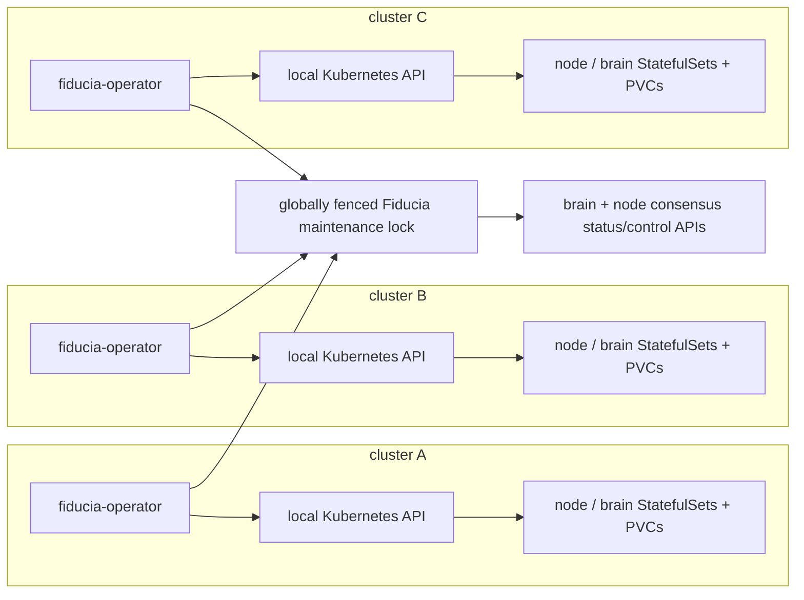

# Fiducia Kubernetes operator architecture

Status: **accepted design; Phase 0 guardrails implemented**

This document answers a narrow question: which parts of running Fiducia need a
custom Kubernetes operator, and which parts should remain ordinary Kubernetes
resources?

## Decision

Build a small, Fiducia-specific operator in Rust, but do not replace Kubernetes
or make the first version a general-purpose database operator.

- Kubernetes continues to own Pods, StatefulSets, Services, PVCs, scheduling,
  probes, Secrets, NetworkPolicies, and ordinary restart-after-crash behavior.
- `fiducia-node` and `fiducia-brain` remain StatefulSets with stable identities
  and per-pod PVCs.
- A future `fiducia-operator.rs` controller owns only operations that require
  distributed-system knowledge: quorum-gated upgrades, leadership drain,
  catch-up verification, coordinated snapshots, restore, and eventually
  membership/placement changes.
- `fiducia-infra` owns the CRDs, RBAC, deployment manifests, examples, and
  GitOps wiring. The Rust controller should live in its own
  `fiducia-operator.rs` repository and consume the official `fiducia-client`
  instead of duplicating HTTP/fencing behavior.
- Until the controller and its required service APIs exist, the node and brain
  StatefulSets use `updateStrategy: OnDelete`. Applying a new template is safe;
  it cannot automatically replace a Raft member.

The reason to write an operator is **not** merely that a process writes files.
The PVC already solves pod-local persistence. The operator is justified when a
safe Kubernetes action depends on state that the Kubernetes API cannot observe.

## Do not conflate the two kinds of logs

Fiducia has two unrelated meanings of “logs”:

1. Application/diagnostic logs go to stdout/stderr and OpenTelemetry. The
   collector sends those to Loki, ClickHouse, or object storage. They do not
   belong on a pod PVC and do not require a custom operator.
2. Raft logs and state-machine snapshots are authoritative replicated state.
   They live under `FIDUCIA_DATA_DIR` on the node/brain PVC, are fsynced before
   acknowledgement, and require consensus-aware lifecycle handling.

The custom operator concerns the second category.

## What Kubernetes handles and what it cannot

| Concern | Native Kubernetes is enough? | Fiducia operator responsibility |
|---|---:|---|
| Stable pod name and network identity | yes | none |
| Per-pod durable storage | yes: StatefulSet + PVC | verify policy/capacity; never delete PVCs |
| Restart a crashed process on the same identity/PVC | yes | observe recovery and alert if it cannot rejoin |
| Spread pods across machines/zones | yes | verify failure-domain intent against brain placement |
| Quorum-safe cross-cluster upgrade | no | serialize maintenance, drain leaders, replace one member, verify catch-up |
| Scale or decommission a Raft member | no | learner → catch-up → voter → leader transfer → remove |
| Consistent backup/restore | no | coordinate application barrier/export plus CSI snapshots and restore validation |
| NATS/JetStream lifecycle | use upstream NATS tooling | no Fiducia-specific controller unless an uncovered requirement remains |
| OpenTelemetry log collection | yes | none |

A PodDisruptionBudget only constrains clients that use the Eviction API.
StatefulSet/Deployment rolling updates and direct pod deletes are not held back
by the PDB. A per-cluster PDB also cannot see the health of Raft members in the
other two clusters. It remains useful defense-in-depth for `kubectl drain`, but
it is not the fleet maintenance lock.

References:

- Kubernetes operator pattern:
  <https://kubernetes.io/docs/concepts/extend-kubernetes/operator/>
- StatefulSet update strategies:
  <https://kubernetes.io/docs/concepts/workloads/controllers/statefulset/>
- Disruptions and the limits of PDB enforcement:
  <https://kubernetes.io/docs/concepts/workloads/pods/disruptions/>
- CSI VolumeSnapshots:
  <https://kubernetes.io/docs/concepts/storage/volume-snapshots/>
- Rust `kube` controller/runtime:
  <https://kube.rs/>

## Current readiness: what blocks a mutating operator

The current services expose enough information to build an **observer**, but
not enough control to let an automated controller replace or resize the fleet:

- `fiducia-node` currently uses fixed membership: every node hosts every shard
  and each group is `self + FIDUCIA_PEERS`.
- `fiducia-node /v1/status` exposes roles, commit/log indices, quorum state,
  storage health, snapshots, and unresponsive shards.
- `fiducia-brain` exposes membership, placement, failure domains, health,
  drain intent, and desired scale.
- The rollout runbook still marks leadership transfer, local node cordon/drain,
  catch-up readiness, and complete drain semantics as rollout gates.
- Disaster-recovery documentation defines the required artifact (shard snapshot
  plus matching Raft metadata), but there is not yet an operator-safe,
  idempotent export/restore API.

Therefore an initial controller must be read-only except for its own CR status
and Events. Pod deletion, membership changes, and restore stay disabled until
the following service contracts exist and have failure-injection tests:

1. Idempotent node and brain cordon/uncordon operations with operation IDs.
2. Leadership transfer to a named, in-sync voter for both shard Raft and brain
   Raft.
3. A catch-up/readiness condition that proves every hosted shard is healthy,
   voting, and caught up; process liveness is insufficient.
4. Version/capability reporting for Raft RPC, API, command, and on-disk snapshot
   formats so an N/N+1 compatibility gate is machine-checkable.
5. Dynamic membership primitives: add learner, observe progress, promote,
   transfer leadership, and remove. Each mutation must be idempotent and fenced.
6. Application-coordinated backup export and restore validation that preserves
   shard IDs, snapshot index/term, encryption-key IDs, and fencing-token
   monotonicity.

The operator must never simulate these contracts by editing `FIDUCIA_PEERS`,
copying PVC files, or treating `Pod Ready` as consensus health.

## Deployment model

Run one operator Deployment in every Fiducia cluster. Each deployment watches
only its local `fiducia` namespace and uses the local Kubernetes API. Do not
give one controller kubeconfigs with administrator access to every cloud.



Coordination has two layers:

1. A standard Kubernetes `Lease` elects one active operator replica inside each
   cluster.
2. Before any disruptive action, the active replica acquires a global,
   renewable, fenced Fiducia maintenance lock such as
   `system/operator/fleet-maintenance`. Operators in the other clusters observe
   the lock and remain read-only.

This deliberately depends on the system having quorum before maintenance. If
Fiducia cannot grant or renew the lock, maintenance stops. The lock token is
recorded on every operation and passed to every service mutation that can
enforce fencing. Loss of the lock immediately stops new actions; it never
causes a best-effort continuation.

The controller ServiceAccount is namespace-scoped:

- get/list/watch StatefulSets, Pods, PVCs, Services, Events, and Leases;
- patch only its CR status, Events, and the local operator Lease;
- patch approved StatefulSet templates and delete Pods only in the mutating
  phase;
- no PVC delete permission;
- no Kubernetes Secret read permission. Credentials are mounted into the pod by
  name, and the controller receives only their values as files/environment.

## Proposed API

Keep the API small. Two namespaced CRDs are sufficient for the first useful
versions.

### `FiduciaCluster`

Long-lived desired state and observed fleet summary:

```yaml
apiVersion: operator.fiducia.cloud/v1alpha1
kind: FiduciaCluster
metadata:
  name: fiducia
  namespace: fiducia
spec:
  clusterId: hetzner
  nodeStatefulSet: fiducia-node
  brainStatefulSet: fiducia-brain
  maintenance:
    maxUnavailableFailureDomains: 1
    requireRecentBackup: true
    paused: false
status:
  observedGeneration: 7
  phase: Ready
  placementGeneration: 418
  healthyFailureDomains: 3
  underReplicatedShards: 0
  leaderlessShards: 0
  conditions:
    - type: QuorumHealthy
      status: "True"
    - type: StorageHealthy
      status: "True"
    - type: OperatorMutationReady
      status: "False"
      reason: MissingLeadershipTransferAPI
```

Status is a summary, not a second authority. Brain/node Raft state remains
authoritative. Conditions follow normal Kubernetes conventions and always
include `observedGeneration`, a stable reason code, and human-readable detail.

### `FiduciaMaintenance`

An explicit, auditable request for one bounded operation:

```yaml
apiVersion: operator.fiducia.cloud/v1alpha1
kind: FiduciaMaintenance
metadata:
  name: node-v0-2-0
  namespace: fiducia
spec:
  operationId: 01J...              # immutable idempotency key
  action: Upgrade                  # Restart | Upgrade | Backup | Restore | Scale
  component: Node                 # Node | Brain
  targetImage: ghcr.io/fiducia-cloud/fiducia-node@sha256:...
  canary:
    clusterId: hetzner
    pod: fiducia-node-4
  approval: Approved
  paused: false
status:
  phase: WaitingForServiceCapability
  activeCluster: null
  activePod: null
  fencingToken: null
  conditions: []
```

`approval` is explicit. A Git commit that updates the StatefulSet template is
not by itself permission to delete a Raft member. `operationId` and target
fields become immutable after work starts.

Use a finalizer only on an in-progress `FiduciaMaintenance`, where cleanup must
release drain state and the global lock. Cleanup is idempotent. Document the
break-glass finalizer removal path because an unavailable controller can
otherwise leave deletion pending.

## Reconcile protocol for restart/upgrade

Every transition is persisted in status before the next side effect, and every
side effect is idempotent under the immutable `operationId`.

1. Observe Kubernetes, brain, and every targeted node. Refuse to start with
   incomplete/unresponsive status.
2. Acquire and renew the global fenced maintenance lock.
3. Verify three healthy failure domains, full shard replication, no leaderless
   shards, healthy storage, no concurrent scale/rebalance, a recent backup if
   policy requires it, and compatible N/N+1 protocols.
4. Select exactly one cluster and one pod. Mark the node `Draining`.
5. Transfer every local shard leadership to a named, caught-up voter in another
   failure domain. For brain maintenance, transfer brain leadership first.
6. Confirm routing has converged and the target reports no leadership. Drain
   in-flight requests.
7. Update the StatefulSet template if needed, then delete only the approved pod.
   The StatefulSet recreates the same ordinal attached to the same PVC.
8. Wait for strict service catch-up, not Kubernetes process readiness: every
   hosted shard healthy, voting, and at the leader commit index; expected image
   and protocol versions active.
9. Uncordon the member, verify full replication and a stable observation window,
   then proceed to the next explicitly selected pod.
10. Release the global lock only after fleet health has returned to the
    pre-operation baseline.

Any timeout or contradictory observation sets a `Blocked` condition and stops.
The controller does not delete another pod, force membership, lower RF, or
discard a PVC to “make progress.”

## Backup and restore boundary

A CSI VolumeSnapshot is useful but not sufficient by itself. An uncoordinated
snapshot can capture Raft files at different logical indices, and one volume is
only one replica's local state.

The target backup protocol is:

1. Acquire the global maintenance lock.
2. Ask the application for a consistent export/barrier and receive a manifest
   of shard IDs, snapshot index/term, checksum, protocol version, encryption-key
   IDs, and fencing-token high-water marks.
3. Create retained CSI `VolumeSnapshot` objects (where the provider supports
   them) or upload the application export to versioned object storage.
4. Verify the artifacts from a separate restore job and record the result in
   `FiduciaMaintenance.status`.

Restore is a separate, explicitly approved operation into an empty generation.
It never overlays a running PVC and never permits an old member/PVC to rejoin
with a lower fencing-token history. Encryption keys are backed up and rotated
separately; old key IDs remain available while any retained backup needs them.

## Implementation phases

| Phase | Controller permissions | Exit criterion |
|---|---|---|
| **0 — now** | no controller; `OnDelete` guardrail | manifests/tests prevent automatic node/brain rolls |
| **1 — observer** | read workloads/services; patch CR status + Events | reports quorum/storage/version blockers without mutating workloads |
| **2 — safe restart/upgrade** | add StatefulSet patch + targeted Pod delete | drain, leadership transfer, strict catch-up, fencing, and mixed-version tests are green |
| **3 — backup/restore** | create snapshot/export/verification Jobs; no PVC delete | automated restore drill proves checksums, metadata, keys, and token monotonicity |
| **4 — elastic membership** | invoke fenced service APIs; Kubernetes scale follows committed placement | learner/promote/transfer/remove is implemented end-to-end and chaos-tested |

Use the Rust `kube` controller runtime and `CustomResource` derive directly.
The reconciler should use server-side apply for owned fields, structured
Kubernetes Events, exponential backoff, cancellation-safe/idempotent steps,
OpenTelemetry, and the official Fiducia client. Pin reviewed dependency
versions and generate CRD YAML from the Rust types in CI so schemas cannot
drift.

## Required tests before enabling mutations

- Reconcile idempotency after cancellation between every pair of side effects.
- Global lock loss and stale fencing-token rejection.
- One complete canary, rollback, and resume after operator restart.
- Concurrent maintenance requests in different clusters: only one acts.
- Node/brain crash during every rollout phase.
- Cross-cluster partition before and after leadership transfer.
- Lagging follower, oversized snapshot, storage fault, and unresponsive shard.
- N/N+1 compatibility rejection and expand/contract success.
- Backup corruption, missing encryption key, stale snapshot, and full restore.
- Proof that the controller never deletes a PVC and never acts from Pod
  readiness alone.

Run these first against the three-kind-cluster WAN/partition harness, then
against the disposable Hetzner E2E tier. Production mutation remains disabled
until both tiers pass.
